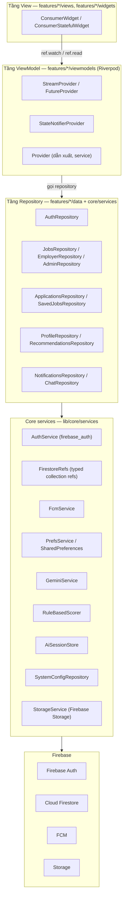
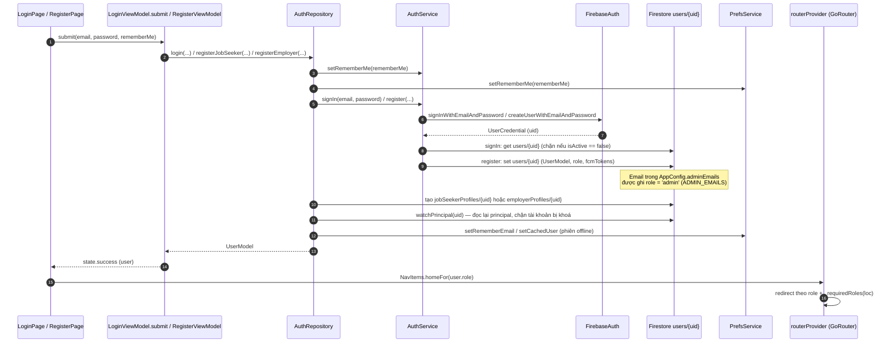

# 03. Tài liệu kiến trúc — JobHub Mobile (Flutter)

> Project: `jobhub_prm393` — port ứng dụng web JobHub (Express + Supabase) sang Flutter mobile với **Firebase Auth + Cloud Firestore + FCM**, quản lý trạng thái bằng **Riverpod 2**, kiến trúc **MVVM**, lưu local bằng **SharedPreferences**.
> Mọi tên class / method / provider nêu trong tài liệu đều lấy trực tiếp từ mã nguồn (`lib/`), đã đối chiếu tại chỗ.

---

## 1. Tổng quan kiến trúc

### 1.1. Sơ đồ tầng



### 1.2. Nguyên tắc phân tầng

- **View không đụng Firestore trực tiếp.** Mỗi màn hình (`features/*/views`, `features/*/widgets`) chỉ tương tác qua `ref.watch(...)` / `ref.read(...)`; toàn bộ truy cập dữ liệu nằm trong repository của feature (`features/*/data`) hoặc core service (`lib/core/services`).
- **Repository là nơi duy nhất gọi Firestore**, thông qua `FirestoreRefs` — lớp typed collection reference (một method cho mỗi collection, dùng `withConverter` để map `fromJson/toJson` của model). Tên collection trong `FirestoreRefs` là nguồn chân lý cho `firestore.rules` và `firestore.indexes.json`.
- **Mọi lỗi được chuẩn hoá về `Failure`** (`lib/core/utils/failure.dart`): kèm thông điệp tiếng Việt cho người dùng, `status` kiểu HTTP (401/403/404/409/…), mã máy (`code`) và `fieldErrors`. `Failure.from(e)` là mapper dùng chung của mọi ViewModel — biến `FirebaseAuthException`, `FirebaseException`, `SocketException`… thành thông báo hiển thị được.
- **Cấu trúc thư mục theo feature**: `lib/features/<feature>/{views, viewmodels, widgets, data}`; model dùng chung nằm ở `lib/shared/models`; hạ tầng nằm ở `lib/core/{services, providers, router, config, utils, theme}`.

### 1.3. Core services

| Service / lớp | File | Vai trò |
|---|---|---|
| `AuthService` | `lib/core/services/auth_service.dart` | Bọc `FirebaseAuth`: `signIn`, `register`, `sendPasswordReset`, `changePassword`, `signOut`, `setRememberMe` (LOCAL vs SESSION trên web). Tự ghi `users/{uid}` khi đăng ký; email nằm trong `AppConfig.adminEmails` được nâng lên `role = 'admin'`. |
| `FirestoreRefs` | `lib/core/services/firestore_refs.dart` | Typed reference cho mọi collection: `users`, `jobSeekerProfiles`, `employerProfiles`, `categories`, `skills`, `jobs`, `applications` (+ sub `statusHistory`), `resumes` (+ sub `aiAnalyses`), `jobRecommendations`, `savedJobs`, `notifications`, `aiMatchingLogs`, `systemConfigurations`, `chats` (+ sub `messages`), `users/{uid}/aiSessions`. |
| `FcmService` | `lib/core/services/fcm_service.dart` | FCM + local notification (singleton `FcmService.instance`): xin quyền, tạo Android channel `jobhub_default`, đăng/gỡ token vào `users/{uid}.fcmTokens`, xử lý tap thông báo. |
| `PrefsService` | `lib/core/services/prefs_service.dart` | Wrapper SharedPreferences: `themeMode`, `locale`, `rememberEmail`, `rememberMe`, `lastRole`, `notificationsEnabled` + bật/tắt theo loại thông báo, `onboardingDone`, `fcmToken`, `lastSearchKeywords`, `jobDraft`, `cachedUser` (phiên offline). |
| `GeminiService` | `lib/core/services/ai/gemini_service.dart` | Gọi Gemini qua endpoint tương thích OpenAI (`chatCompletion`), prompt port nguyên bản từ backend: `extractResume` (task `resume_extraction`) và `scoreJobs` (task `job_matching`); `testKey` ping; mọi lời gọi đều ghi log qua `AiLogSink`. |
| `RuleBasedScorer` | `lib/core/services/ai/rule_based_scorer.dart` | Port Dart của `scoreJobsSql`: chấm điểm tất định, offline, cùng bộ 7 tiêu chí với AI. |
| `AiSessionStore` | `lib/core/services/ai_session_store.dart` | Phiên chấm điểm trong SharedPreferences (key `jobhub.aiSessions`), mới nhất trước, giới hạn `AppConfig.aiSessionCap = 20`, có migrate từ key cũ. |
| `SystemConfigRepository` | `lib/core/services/system_config_repository.dart` | `systemConfigurations/{key}`: `watchAll`, `getAll`, `get`, `getNumber`, `getBool`, `getString`; chứa defaults (`MAX_SKILLS_PER_JOB`, `DEFAULT_DEADLINE_DAYS`, `REQUIRE_JOB_APPROVAL`, `GEMINI_API_KEY`). |
| `StorageService` | `lib/core/services/storage_service.dart` | `uploadResume` / `uploadImage` / `delete` trên Firebase Storage (project hiện chưa bật Storage — xem mục 3.4). |

---

## 2. Kiến trúc MVVM & Riverpod

### 2.1. Các loại provider sử dụng

| Loại provider | Mục đích | Ví dụ thật trong mã nguồn |
|---|---|---|
| `StreamProvider` | Dữ liệu Firestore realtime (`snapshots()`), tự re-build UI khi dữ liệu đổi | `currentUserProvider` — `StreamProvider<UserModel?>` trong `lib/features/auth/viewmodels/current_user_provider.dart`; `savedJobIdsProvider` — `StreamProvider<Set<String>>` trong `lib/features/jobs/viewmodels/saved_jobs_provider.dart`; `notificationsStreamProvider` — `StreamProvider<List<NotificationModel>>`; `appliedJobIdsProvider` — `StreamProvider<Set<String>>` trong `lib/features/applications/viewmodels/applications_providers.dart`; `savedJobsStreamProvider`; `analyzedResumesProvider`; `systemConfigsProvider`; `authStateProvider` |
| `FutureProvider` | Đọc một lần (async), thường `autoDispose.family` theo id | `applyJobProvider` — `FutureProvider.autoDispose.family<JobModel?, String>`; `latestRecommendationProvider` — `FutureProvider.autoDispose` |
| `StateNotifierProvider` | Form / luồng có nhiều bước, state bất biến + method (`submit`, `load`…) | `loginViewModelProvider`, `registerViewModelProvider` (`LoginViewModel`, `RegisterViewModel`); `applyViewModelProvider` — `StateNotifierProvider.autoDispose.family<ApplyViewModel, ApplyState, String>`; `reviewViewModelProvider` — family theo `applicationId`; `createJobViewModelProvider`; `jobsSearchProvider` — `StateNotifierProvider.autoDispose<JobsSearchViewModel, JobsSearchState>`; `aiMatchingViewModelProvider`; `resumesViewModelProvider`; `notificationsControllerProvider`; `sessionsProvider` |
| `Provider` | Giá trị dẫn xuất (compute) hoặc instance service/repository | `unreadCountProvider` — `Provider<int>` đếm `!isRead` từ `notificationsStreamProvider`; `filteredNotificationsProvider`; `currentUidProvider`; `routerProvider` (GoRouter); `geminiServiceProvider`; `firestoreRefsProvider`; `authServiceProvider`; `prefsServiceProvider`; `aiSessionStoreProvider`; `fcmTokenRegistrationProvider`; các `*RepositoryProvider` |
| `StateProvider` | State đơn giản (filter tab, marker bootstrap) | `notificationFilterProvider`; `authBootstrappingProvider` |

### 2.2. Chu trình dữ liệu điển hình

1. **View** (`ConsumerWidget`) `ref.watch` một provider.
2. Provider đọc dependency khác (vd `currentUserProvider` lấy uid) rồi gọi **repository**.
3. **Repository** dùng `FirestoreRefs` để `snapshots()` / `get()` / `set()` / `runTransaction`; lỗi được bọc `Failure.from(e)` trước khi ném lên.
4. View nhận `AsyncValue` (loading / data / error) và render; hành động ghi gọi `ref.read(...).notifier` (StateNotifier) hoặc hàm tiện ích (vd `toggleSavedJob`).

Ví dụ hợp đồng liên feature: `savedJobIdsProvider` phát `Set<String>` jobId đã lưu để mọi card việc làm hiển thị đúng trạng thái bookmark mà không cần query lại; `toggleSavedJob(WidgetRef ref, JobModel job)` trong `lib/features/jobs/viewmodels/saved_jobs_provider.dart` quyết định save/remove dựa trên set đã stream (không `get` thêm), ném `Failure.unauthorized` cho khách và `Failure.forbidden` cho role khác ứng viên.

### 2.3. Điều hướng & guard

`routerProvider` (`lib/core/router/app_router.dart`) dựng `GoRouter` với `refreshListenable` theo `authStateProvider` + `currentUserProvider`:

- Chưa đăng nhập vào route guarded → chuyển `/dang-nhap`.
- `users/{uid}` lỗi 3 lần và không có bản cache → coi như đã đăng xuất.
- Đúng đăng nhập nhưng vào trang auth → `NavItems.homeFor(role)` theo role.
- Sai role → `ForbiddenPage` (403 in-place, tương đương `RoleGuard.jsx`). Bản đồ role nằm trong `_requiredRoles(loc)`: `/admin/**` chỉ admin, `/employer/**` là employer (riêng `/employer/applications/**` cho cả employerOrAdmin), hồ sơ/ứng tuyển chỉ job seeker, thông báo/chat/cài đặt cho mọi role đã đăng nhập.

---

## 3. Các luồng nghiệp vụ chính

### 3.1. Đăng ký / đăng nhập



Chi tiết đã đối chiếu:

- `AuthService.signIn` kiểm tra `users/{uid}.isActive == false` → `signOut` + `Failure(..., status: 403, code: 'ACCOUNT_DISABLED')`. `AuthService.register` từ chối `role == 'admin'` tự đăng ký; email thuộc `AppConfig.adminEmails` thì `effectiveRole = 'admin'`.
- `AuthRepository.login` ghi nhớ email (`setRememberEmail`) / khoá cache user (`setCachedUser`); `PrefsService` còn định nghĩa sẵn `lastRole` cho việc ghi nhớ role ưu tiên (preference, không bắt buộc trong luồng); `registerJobSeeker` / `registerEmployer` ghi hồ sơ role tương ứng và **rollback** (xoá account vừa tạo) nếu bước Firestore thất bại (`_rollbackRegistration`).
- `authBootstrappingProvider` giữ `currentUserProvider` ở trạng thái loading trong lúc đăng nhập/đăng ký dở dang để router không rời trang giữa chừng.
- Offline: `_watchWithOfflineFallback` retry 3 lần mỗi 2 giây, giữ principal từ `PrefsService.cachedUser` khi mạng lỗi (tương đương semantic AuthContext trên web).

### 3.2. Đăng tin → duyệt → hiển thị công khai

```mermaid
sequenceDiagram
    autonumber
    participant CJP as CreateJobPage
    participant CVM as CreateJobViewModel.submit
    participant ER as EmployerRepository
    participant FSB as Batch Firestore
    participant AP as AdminPendingJobsPage
    participant ADM as AdminRepository.moderateJob
    participant JQ as jobs collection
    participant JSP as JobsSearchPage

    CJP->>CVM: submit() (JobFormInput + draft local qua PrefsService.jobDraft)
    CVM->>ER: createJob(employerId, input)
    ER->>FSB: batch: upsert category + skills, set jobs/{id}
    note over FSB: JobModel: status = DRAFT khi requireApproval,<br/>isApproved = false,<br/>titleTokens = JobModel.tokenize(title, employerName),<br/>applicationsCount = 0
    ER-->>CVM: JobModel (done)
    ADM->>JQ: watchPendingJobs(): status == 'DRAFT' && isApproved == false
    AP->>ADM: moderateJob(job, approve: true)
    ADM->>JQ: update status = 'OPEN', isApproved = true, moderatedAt
    ADM->>ADM: NotificationsRepository.create(JOB_APPROVED) cho employer
    note over JQ: Bài từ chối: status = 'CLOSED', isApproved = false,<br/>thông báo JOB_REJECTED
    JSP->>JSP: JobsRepository.watchPublicJobs():<br/>isApproved == true && status == 'OPEN', createdAt DESC
    note over JSP: Từ khoá: lọc client-side trên tập đã tải;<br/>quy ước titleTokens arrayContainsAny (tối đa 10 token)<br/>đã có composite index sẵn trong firestore.indexes.json
```

Chi tiết đã đối chiếu:

- `EmployerRepository.createJob` (được `CreateJobViewModel.submit` gọi qua `employerRepositoryProvider`): dựng `JobModel` với `status: requireApproval ? JobStatus.draft : JobStatus.open`, `isApproved: !requireApproval` (nguồn `requireApproval` là `SystemConfigRepository` — key `REQUIRE_JOB_APPROVAL`), `titleTokens: JobModel.tokenize(...)`, tăng `categories.jobCount` trong cùng batch.
- `JobModel.tokenize(title, company)` sinh token chữ thường bỏ dấu (kèm tiền tố 2–6 ký tự để khớp "starts-with"), tối đa 60 token lưu trên doc; phía truy vấn dùng tối đa 10 token cho `arrayContainsAny` (giới hạn của Firestore).
- `AdminRepository.watchPendingJobs` lọc `status == 'DRAFT' && isApproved == false`; `moderateJob(job, approve:)` cập nhật `status/isApproved/moderatedAt/updatedAt` rồi `NotificationsRepository.create` loại `JOB_APPROVED`/`JOB_REJECTED`.
- Truy vấn công khai trong `JobsRepository._publicQuery`: `where('isApproved', isEqualTo: true).where('status', isEqualTo: 'OPEN')` + `orderBy('createdAt', descending: true)`. Màn hình tìm kiếm (`JobsSearchPage` + `jobsSearchProvider`) hiện tải tối đa 1000 việc công khai rồi lọc/sắp xếp/phân trang phía client (giữ nguyên hành vi web `JobsPage`); pattern `titleTokens arrayContainsAny` là quy ước truy vấn từ khoá đã được index sẵn cho các màn hình cần query server-side.

### 3.3. Ứng tuyển → đổi trạng thái → thông báo

```mermaid
sequenceDiagram
    autonumber
    participant AM as ApplyModal / ApplyJobPage
    participant AVM as ApplyViewModel (applyViewModelProvider.family)
    participant APR as ApplicationsRepository
    participant TX as runTransaction Firestore
    participant ERV as EmployerApplicationReviewPage
    participant RVM as ReviewViewModel.updateStatus
    participant NTF as notifications collection
    participant NAV as NotificationNavigator + FcmService
    participant NP as NotificationsPage

    AM->>AVM: load() → getApplyContext(seekerUid, jobId)
    AVM->>APR: getProfile + getJob + hasApplied (duplicate check)
    AVM-->>AM: ApplyState (ready / blocker / missingProfile)
    AM->>AVM: submit() (coverLetter ≤ 5000, chọn CV)
    AVM->>APR: apply(seeker, profile, job, resume, coverLetter)
    APR->>TX: docId = ApplicationModel.docIdFor(seekerUid, jobId)
    note over TX: Transaction: (1) đọc jobs/{id} — còn công khai, chưa hết hạn;<br/>(2) duplicate check theo docId;<br/>(3) set applications/{seekerUid_jobId} status SUBMITTED + denormalize;<br/>(4) set statusHistory genesis row;<br/>(5) increment jobs.applicationsCount;<br/>(6) set notification NEW_APPLICATION cho employer
    TX-->>AVM: ApplicationModel
    ERV->>RVM: chọn trạng thái mới (dropdown)
    RVM->>APR: updateStatus(applicationId, expectedCurrentStatus, newStatus, actor, note)
    APR->>TX: transaction
    note over TX: Kiểm tra app.status == expectedCurrentStatus<br/>(lệch → 409 APPLICATION_STATUS_CONFLICT);<br/>kiểm tra ApplicationModel.transitions[status] chứa newStatus<br/>(sai → 400 'Chuyển trạng thái không hợp lệ.');<br/>update status + append statusHistory + notification APPLICATION_STATUS
    APR->>NTF: (trong transaction) set notifications/{id}
    NTF-->>NP: notificationsStreamProvider.watchForUser(uid) — realtime
    NAV->>NAV: ref.listen(notificationsStreamProvider) → FcmService.showLocal<br/>(foreground trên mobile; thay Cloud Functions)
    NAV->>NP: tap → notificationRouteFor(type, data) → deep-link
```

Chi tiết đã đối chiếu:

- Doc id tất định: `ApplicationModel.docIdFor(jobSeekerId, jobId)` = `'{jobSeekerId}_{jobId}'` — ràng buộc UNIQUE(job_seeker_id, job_id) của SQL được thực thi bằng chính id document; `statusHistory` là subcollection append-only (rules cấm update/delete).
- Ma trận chuyển trạng thái `ApplicationModel.transitions`: `SUBMITTED → UNDER_REVIEW | ACCEPTED | REJECTED`; `UNDER_REVIEW → ACCEPTED | REJECTED`; `ACCEPTED`/`REJECTED` là trạng thái cuối. Chỉ 4 trạng thái được lộ ra cho UI.
- `ApplicationsRepository.updateStatus` nhận `expectedCurrentStatus` (optimistic concurrency) và thực hiện toàn bộ ghi trong MỘT transaction: đổi `status` (`enumToWire`), thêm dòng `statusHistory`, tạo notification `APPLICATION_STATUS` cho ứng viên. `ApplicationsRepository.apply` cũng là một transaction duy nhất (genesis history + đếm + thông báo).
- Trong luồng apply/updateStatus, notification được `tx.set` trực tiếp collection `notifications` (kèm `recipientUid` legacy); `AdminRepository.moderateJob` dùng `NotificationsRepository.create(...)`. Vì project free plan **không có Cloud Functions**, thông báo đẩy trên thiết bị do `NotificationNavigator` đảm nhiệm: lắng nghe `notificationsStreamProvider`, hiện `FcmService.showLocal` theo toggle trong Settings; tap (FCM background/terminated hoặc local) đi qua `FcmService.onNotificationTap` → `handleNotificationTap` → `notificationRouteFor`.

### 3.4. Upload CV → AI phân tích → AI matching → lưu phiên

```mermaid
sequenceDiagram
    autonumber
    participant RP as ResumeProfilePage / ResumesViewModel
    participant PR as ProfileRepository
    participant STO as StorageService
    participant RS as resumes collection
    participant GS as GeminiService
    participant LOG as aiMatchingLogs (aiLogSinkProvider)
    participant RDP as RecommendedPage / AiMatchingViewModel.score
    participant RBS as RuleBasedScorer
    participant ASE as AiSessionStore (SharedPreferences)
    participant RM as users/{uid}/aiSessions

    RP->>PR: createResume(uid, title, fileName, bytes, rawText)
    PR->>STO: uploadResume (PDF) — Storage chưa bật thì fallback
    note over PR: Firebase Storage chưa kích hoạt (no Blaze):<br/>lưu doc metadata/text; khuyến khích "Dán nội dung CV"
    PR->>RS: set resumes/{id} (+ primaryResumeId nếu CV đầu)
    RP->>PR: saveRawText(resumeId, text) — dán text CV
    RP->>PR: analyzeResume(uid, resume)
    PR->>GS: extractResume(rawText) — prompt resume_extraction
    GS->>LOG: _log(task, prompt, response, tokens, ms)
    GS-->>PR: AiAnalysis (skills, softSkills, experience, education, languages, ...)
    PR->>RS: batch set resumes/{id}/aiAnalyses/{id} + nhúng resume.aiAnalysis
    RDP->>RDP: _resolveCv(): CV đã phân tích (toCvPayload) hoặc text mới (extractResume)
    RDP->>RBS: RuleBasedScorer.scoreJobs(cv, jobs) — 7 tiêu chí tất định
    RDP->>GS: scoreJobs(cv, batch 10 jobs) — song song 2, retry backoff
    GS->>LOG: _log(task job_matching, ...)
    GS-->>RDP: List<JobScore> (matchScore, breakdown 7 tiêu chí, weights, reason)
    note over RDP: JobScore.breakdown: skills, experience, education,<br>domain, softSkills, language, careerFit (trọng số 30/20/10/15/10/5/10)
    RDP->>ASE: AiSessionStore.saveSession(cvName, method, scores, jobs)
    note over ASE: key 'jobhub.aiSessions', mới nhất trước,<br>cap AppConfig.aiSessionCap = 20
    RDP->>RM: mirror best-effort users/{uid}/aiSessions/{sessionId}
    RDP->>RDP: upsertRecommendations → jobRecommendations/{uid_jobId}
```

Chi tiết đã đối chiếu:

- **Upload CV**: `ResumesViewModel.upload` validate (PDF/.txt ≤ 5 MB) rồi gọi `ProfileRepository.createResume`. `StorageService.uploadResume` tồn tại nhưng project chưa bật Firebase Storage (không có Blaze plan) — `createResume` catch lỗi và rơi về doc chỉ chứa metadata/text (`fileStored = false`), view hiện thông báo hướng dẫn dùng "Dán nội dung CV" (`showPasteResumeTextDialog` → `ProfileRepository.saveRawText`). Phân tích AI cần `rawText` không rỗng (`EMPTY_RESUME_TEXT` nếu trống).
- **AI phân tích**: `ProfileRepository.analyzeResume` → `GeminiService.extractResume(text, jobSeekerId:, resumeId:)` (giới hạn `AppConfig.aiResumeTextCap = 8000` ký tự), kết quả `AiAnalysis` ghi vào subcollection `resumes/{id}/aiAnalyses/{analysisId}` và nhúng bản sao vào `resumes/{id}.aiAnalysis` trong một batch.
- **AI matching**: `AiMatchingViewModel.score()` (provider `aiMatchingViewModelProvider`) chọn engine `ScoringMethod` ai/sql/both. SQL dùng `RuleBasedScorer.scoreJobs(cv, jobs)` — điểm theo 7 tiêu chí: skills 30, experience 20, education 10, domain 15, softSkills 10, language 5, careerFit 10. AI chia việc làm thành batch 10 (`AppConfig.aiBatchSize`), chạy song song 2 (`AppConfig.aiMaxConcurrency`), tối đa 100 job/lượt (`aiMaxJobsPerScoring`), mỗi batch `GeminiService.scoreJobs` tự retry tối đa 2 lần khi JSON lỗi; nếu chọn SQL mà không trích xuất được CV bằng AI thì fallback `_naiveCv` (trích từ khoá). Mọi lời gọi Gemini ghi `aiMatchingLogs` qua `aiLogSinkProvider` (prompt, response, tokens in/out, thời gian, success/error).
- **Lưu phiên**: `RecommendationsRepository.saveSession` ghi local (`AiSessionStore.saveSession`, cap 20) rồi mirror best-effort `users/{uid}/aiSessions`; remote sessions thiếu local được `mergeRemoteIntoLocal` gộp về (đồng bộ đa thiết bị). "Lưu kết quả" (`saveResults`) còn upsert `jobRecommendations/{seekerUid_jobId}` (`JobRecommendation.docIdFor`) để trang chi tiết hồ sơ ứng tuyển hiện "Điểm phù hợp".

---

## 4. Mô hình dữ liệu

### 4.1. Mapping 18 bảng SQL gốc → Firestore → model Dart

Nguồn SQL: `jobhub/docs/full_database_schema.sql` (script fresh install, đủ 18 bảng — gồm cả `application_status_history` của migration 004+005; `08_DATABASE.md` chỉ liệt kê 17 bảng). Riêng `system_configurations` do backend dùng qua `systemConfigurationRepository.js` nhưng không nằm trong script SQL — xem ghi chú dưới bảng.

| # | Bảng SQL gốc | Collection / path Firestore | Model Dart (`lib/shared/models`) | Ghi chú |
|---|---|---|---|---|
| 1 | `job_seeker` | `users/{uid}` (role `job_seeker`) + `jobSeekerProfiles/{uid}` | `UserModel`, `JobSeekerProfile` | Tài khoản hợp nhất trong `users`; hồ sơ riêng theo role |
| 2 | `employer` | `users/{uid}` (role `employer`) + `employerProfiles/{uid}` | `UserModel`, `EmployerProfile` | `employerProfiles` đọc công khai (trang công ty) |
| 3 | `admin` | `users/{uid}` (role `admin`) | `UserModel` | Không tự đăng ký; cấp qua `AppConfig.adminEmails` |
| 4 | `category` | `categories/{cat-...}` | `CategoryModel` | id slug `slugId('cat', name)`; có `jobCount` |
| 5 | `skill` | `skills/{skill-...}` | `SkillModel` | upsert theo tên khi tạo tin / sửa hồ sơ |
| 6 | `resume` | `resumes/{resumeId}` | `ResumeModel` | `rawText` cho AI; `isPrimary`; Storage chưa bật |
| 7 | `ai_analysis` | `resumes/{resumeId}/aiAnalyses/{analysisId}` (+ nhúng `resumes/{id}.aiAnalysis`) | `AiAnalysis` | Lịch sử phân tích theo CV |
| 8 | `work_experience` | nhúng `jobSeekerProfiles/{uid}.workExperiences[]` | `WorkExperience` | Bảng SQL → mảng nhúng |
| 9 | `education` | nhúng `jobSeekerProfiles/{uid}.educations[]` | `Education` | Bảng SQL → mảng nhúng |
| 10 | `job_seeker_skill` | nhúng `jobSeekerProfiles/{uid}.skills[]` | `ProfileSkill` | Bảng SQL → mảng nhúng |
| 11 | `job` | `jobs/{jobId}` | `JobModel` | Thêm `titleTokens`, `applicationsCount`, denormalize employer |
| 12 | `job_skill` | nhúng `jobs/{jobId}.requiredSkills[]` | `JobSkillRef` | Bảng SQL → mảng nhúng |
| 13 | `application` | `applications/{jobSeekerId}_{jobId}` | `ApplicationModel` | Doc id tất định thay UNIQUE constraint; denormalize job/seeker/employer |
| 14 | `application_status_history` | `applications/{appId}/statusHistory/{id}` | `ApplicationStatusHistoryItem` | Bảng SQL → subcollection append-only (thay trigger/audit); rules cấm update/delete |
| 15 | `job_recommendation` | `jobRecommendations/{jobSeekerId}_{jobId}` | `JobRecommendation` | `JobRecommendation.docIdFor` |
| 16 | `saved_job` | `savedJobs/{jobSeekerId}_{jobId}` | `SavedJob` | `SavedJob.docIdFor`; có `jobSnapshot` |
| 17 | `notification` | `notifications/{id}` | `NotificationModel` | `recipientId` + `recipientRole` + `data` deep-link |
| 18 | `ai_matching_log` | `aiMatchingLogs/{logId}` | `AiMatchingLog` | Chỉ admin được đọc (rules) |

Ngoài 18 bảng SQL gốc, Firestore còn có: `systemConfigurations/{key}` (`SystemConfig` — key `MAX_SKILLS_PER_JOB`, `DEFAULT_DEADLINE_DAYS`, `REQUIRE_JOB_APPROVAL`, `GEMINI_API_KEY`; backend dùng qua `systemConfigurationRepository.js` nhưng bảng không nằm trong script SQL). Riêng mobile thêm: `chats/{chatId}` + `messages/{id}` (`ChatThread`, `ChatMessage`, doc id `ChatThread.docIdFor(a, b)`) và `users/{uid}/aiSessions/{sessionId}` (`AiSession` — mirror phiên chấm điểm AI).

### 4.2. Quy ước dữ liệu

- **Field camelCase** (`jobTitle`, `employerName`, `applicationDate`…); model là nơi duy nhất `fromJson/toJson`.
- **Enum UPPER_SNAKE_CASE trên wire** qua `enumToWire` (`lib/core/utils/enums.dart`): `ApplicationStatus.underReview` → `UNDER_REVIEW`; riêng role dùng `userRoleToWire` → `job_seeker | employer | admin`. Bộ giá trị giữ nguyên tương thích PostgreSQL enum của web.
- **Thời gian**: model ghi `Timestamp.fromDate(...)`; trường audit (`createdAt`/`updatedAt` tạo bởi server) dùng `FieldValue.serverTimestamp()`.
- **Doc id tất định** thay cho UNIQUE constraint: `ApplicationModel.docIdFor`, `SavedJob.docIdFor`, `JobRecommendation.docIdFor`, `ChatThread.docIdFor` — đều dạng `{a}_{b}`.
- **Ghi nhiều documents**: một `db.runTransaction` (apply / đổi trạng thái — đọc-kiểm-rồi-ghi) hoặc `db.batch` (chunk ≤ 400–450 thao tác, dưới trần 500 của Firestore).
- **Trạng thái + lịch sử**: mỗi lần đổi `status` đều append một doc `statusHistory` (oldStatus, newStatus, changedBy, changedByRole, changedAt, note) trong cùng transaction; rules đặt `update, delete: if false` để audit bất biến.
- **Tìm kiếm tiêu đề**: `jobs.titleTokens` — token chữ thường không dấu + tiền tố 2–6 ký tự (tối đa 60 token/doc, `JobModel.tokenize`); query theo `where('titleTokens', arrayContainsAny: tokens)` dùng tối đa 10 token (giới hạn Firestore); composite index tương ứng đã khai báo.

---

## 5. Cấu hình & bảo mật

### 5.1. firestore.rules — tóm tắt theo role

Các helper: `role()` đọc `users/{uid}.role`, `active()` kiểm tra `isActive != false`; `isAdmin()` / `isEmployer()` / `isSeeker()` = đăng nhập + đúng role + còn hoạt động; `onlyKeys(keys)` giới hạn field được sửa.

| Collection | Đọc | Ghi |
|---|---|---|
| `users/{uid}` | Đăng nhập | create: chủ tài khoản, role hợp lệ, `isActive == true`; update: admin, hoặc chủ tài khoản chỉ sửa `fullName, phone, photoUrl, headline, city, website, fcmTokens, updatedAt`; delete: admin. Sub `aiSessions`: chủ tài khoản |
| `jobSeekerProfiles/{uid}` | Chủ tài khoản, employer, admin | create/update: chủ tài khoản hoặc admin; delete: admin |
| `employerProfiles/{uid}` | **Công khai** (trang công ty) | create/update: chủ tài khoản hoặc admin; delete: admin |
| `categories`, `skills` | Công khai | create/update: admin (categories thêm employer; skills thêm cả seeker); delete: admin |
| `jobs/{id}` | Công khai khi `isApproved == true && status == 'OPEN'`; chủ tin (employerId == uid); admin. Doc chưa tồn tại trả `exists == false` | create: admin hoặc employer tự tạo (`employerId == uid`); update: admin; employer chủ tin nhưng **không được tự duyệt** (`isApproved` phải giữ nguyên); seeker chỉ được tăng `applicationsCount, updatedAt`; delete: admin hoặc chủ tin |
| `applications/{appId}` | `get`: hai bên (seeker/employer của hồ sơ) hoặc admin; doc chưa tồn tại cho phép chủ seeker dò trùng; `list` theo `jobSeekerId`/`employerId` | create: chỉ seeker, `jobSeekerId == uid`, `status == 'SUBMITTED'`; update: admin hoặc employer chủ tin, chỉ các khoá `status, updatedAt, matchScore, recommendationReason`; delete: admin |
| `applications/{id}/statusHistory` | Hai bên hoặc admin | create: đăng nhập và `changedBy == uid`; update/delete: **cấm** (append-only) |
| `resumes/{id}` | Chủ seeker, employer, admin | create: seeker (`jobSeekerId == uid`); update/delete: admin hoặc chủ; sub `aiAnalyses`: chủ CV (đọc cho cả employer/admin) |
| `jobRecommendations/{id}` | get: employer/admin (trang duyệt hồ sơ), seeker chủ doc (kể cả doc chưa tồn tại); list tương tự | write: seeker (`jobSeekerId == uid`) |
| `savedJobs/{id}` | Chỉ seeker (`jobSeekerId == uid`) | Chỉ seeker chủ doc |
| `notifications/{id}` | Admin hoặc người nhận (`recipientId == uid`) | create: bất kỳ đã đăng nhập (do client ghi trong transaction); update: người nhận chỉ được sửa `isRead`, hoặc admin; delete: người nhận hoặc admin |
| `aiMatchingLogs/{id}` | **Chỉ admin** | create: đã đăng nhập (log không được làm hỏng lời gọi AI); update/delete: admin |
| `systemConfigurations/{key}` | Đăng nhập | **Chỉ admin** |
| `chats/{id}` + `messages` | Thành viên (`uid in participants`) | create/update: thành viên (message phải `senderId == uid`); delete thread: admin; messages cấm sửa/xoá |

### 5.2. firestore.indexes.json — các index hợp chất chính

Toàn bộ là `queryScope: COLLECTION` (riêng `statusHistory` là `COLLECTION_GROUP`):

- **jobs** (10 index): bộ lọc công khai `isApproved ASC + status ASC + createdAt DESC` và các biến thể thêm `city / workMode / jobType / categoryId / employerId`; tìm kiếm `titleTokens array-contains + isApproved + status + createdAt DESC`; quản lý tin của employer `employerId + createdAt DESC` và `employerId + status + createdAt DESC`; `status + createdAt DESC` (admin duyệt tin).
- **applications** (9 index): `jobSeekerId + applicationDate (ASC/DESC)`, `jobSeekerId + status + applicationDate DESC`, `employerId + applicationDate (ASC/DESC)`, `employerId + status + applicationDate DESC`, `employerId + jobId + applicationDate DESC`, `jobId + applicationDate DESC`, `jobId + status + applicationDate DESC`.
- **statusHistory** (collection group): `applicationId ASC + changedAt ASC`.
- **notifications**: `recipientId + createdAt DESC` và `recipientId + isRead + createdAt DESC`.
- **resumes**: `jobSeekerId + uploadDate DESC`; `jobSeekerId + isPrimary + uploadDate DESC`.
- **aiAnalyses**: `resumeId + analyzedAt DESC`. **savedJobs**: `jobSeekerId + savedAt DESC`. **jobRecommendations**: `jobSeekerId + matchScore DESC` / `jobSeekerId + generatedAt DESC`.
- **aiMatchingLogs**: `task + createdAt DESC`; `success + createdAt DESC`. **chats**: `participants array-contains + updatedAt DESC`. **users**: `role + createdAt DESC`; `role + isActive + createdAt DESC`. **employerProfiles**: `isVerified + createdAt DESC`; `isActive + isVerified + createdAt DESC`. **aiSessions**: `scoredAt DESC + id ASC`.

Thiếu index sẽ lỗi `failed-precondition` — `Failure.from` đã map thành thông báo nhắc deploy `firestore.indexes.json` (code `MISSING_INDEX`).

### 5.3. FCM — Android, web và VAPID

- **Android**: khai báo `<uses-permission android:name="android.permission.POST_NOTIFICATIONS"/>` trong `android/app/src/main/AndroidManifest.xml` (Android 13+); channel `jobhub_default` ("JobHub notifications", importance high) tạo bởi `FcmService.initialize` qua `flutter_local_notifications`; thông báo foreground tuân theo toggle trong Settings (`PrefsService.notificationsEnabled`, `isNotificationTypeEnabled`).
- **Web**: service worker `web/firebase-messaging-sw.js` khởi tạo Firebase app compat 10.12.0, xử lý `onBackgroundMessage` và `notificationclick` (mở deep-link theo `data.type`/`data.applicationId`). Token web cần VAPID key: chạy với `--dart-define=FCM_VAPID_KEY=...` (Firebase Console → Project settings → Cloud Messaging → Web Push certificates); thiếu key thì push web tắt nhưng ứng dụng vẫn chạy bình thường.
- **Vòng đời token**: `FcmService.refreshToken` → `persistToken` ghi `users/{uid}.fcmTokens` bằng `arrayUnion` (tôn trọng toggle); `fcmTokenRegistrationProvider` tự đăng/gỡ theo đăng nhập + Settings; `AuthService.signOut` gọi `FcmService.instance.removeTokenForCurrentUser` để thiết bị không nhận push của tài khoản cũ.
