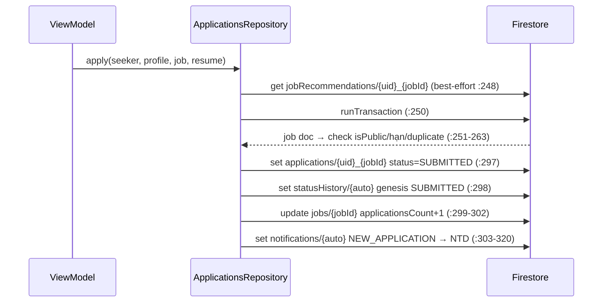
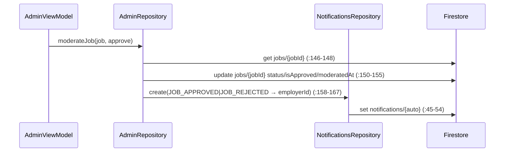
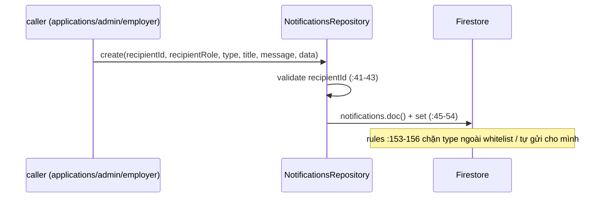

# 07 — API Surface Firestore (tham chiếu nhanh cho người bảo trì)

Nguồn chân lý (đối chiếu 2026-10-03, chỉ đọc):

- `lib/core/services/firestore_refs.dart` — 18 typed collection refs (14 collection + 4 subcollection).
- `firestore.rules` — helpers vai trò tại `firestore.rules:6-15`: `signedIn()` `:6`, `isAdmin()` `:12`, `isEmployer()` `:13`, `isSeeker()` `:14`, `isOwner(id)` `:15`, `onlyKeys(keys)` `:16-18`.
- `firestore.indexes.json` — 36 composite index trên 13 collection group.
- Caller đặt doc id: grep `.doc(` trong `lib/features/*/data/*.dart` (13 file repo) + `lib/core/providers.dart:48`.

Quy ước trích dẫn: `file:line` tính theo bản hiện tại; mọi số liệu dưới đây đã đếm lại tay từ nguồn.

---

## §1 — 18 method của `FirestoreRefs`

Class `FirestoreRefs` (`lib/core/services/firestore_refs.dart:19`), constructor nhận `FirebaseFirestore` (`:20-21`), hằng số tên collection tại `:23-40` (14 hằng `col*` + 4 hằng `sub*`). Converter chung `_col<T>` gắn `withConverter` và tự chèn `id` từ doc id vào JSON khi đọc (`_withId`, `:132-135`).

| # | Method | Collection path | Model type | File model |
|---|--------|-----------------|------------|------------|
| 1 | `users()` `:52` | `users` | `UserModel` | `lib/shared/models/user_model.dart:7` |
| 2 | `jobSeekerProfiles()` `:55` | `jobSeekerProfiles` | `JobSeekerProfile` | `lib/shared/models/jobseeker_profile_model.dart:117` |
| 3 | `employerProfiles()` `:58` | `employerProfiles` | `EmployerProfile` | `lib/shared/models/employer_profile_model.dart:6` |
| 4 | `categories()` `:61` | `categories` | `CategoryModel` | `lib/shared/models/catalog_models.dart:4` |
| 5 | `skills()` `:64` | `skills` | `SkillModel` | `lib/shared/models/catalog_models.dart:25` |
| 6 | `jobs()` `:67` | `jobs` | `JobModel` | `lib/shared/models/job_model.dart:124` |
| 7 | `applications()` `:70` | `applications` | `ApplicationModel` | `lib/shared/models/application_model.dart:62` |
| 8 | `statusHistory(appId)` `:73` | `applications/{appId}/statusHistory` | `ApplicationStatusHistoryItem` | `lib/shared/models/application_model.dart:7` |
| 9 | `resumes()` `:84` | `resumes` | `ResumeModel` | `lib/shared/models/resume_model.dart:98` |
| 10 | `aiAnalyses(resumeId)` `:87` | `resumes/{resumeId}/aiAnalyses` | `AiAnalysis` | `lib/shared/models/resume_model.dart:5` |
| 11 | `jobRecommendations()` `:96` | `jobRecommendations` | `JobRecommendation` | `lib/shared/models/recommendation_models.dart:135` |
| 12 | `savedJobs()` `:99` | `savedJobs` | `SavedJob` | `lib/shared/models/misc_models.dart:4` |
| 13 | `notifications()` `:102` | `notifications` | `NotificationModel` | `lib/shared/models/notification_model.dart:7` |
| 14 | `aiMatchingLogs()` `:105` | `aiMatchingLogs` | `AiMatchingLog` | `lib/shared/models/recommendation_models.dart:199` |
| 15 | `systemConfigurations()` `:108` | `systemConfigurations` | `SystemConfig` | `lib/shared/models/catalog_models.dart:57` |
| 16 | `chats()` `:111` | `chats` | `ChatThread` | `lib/shared/models/misc_models.dart:37` |
| 17 | `messages(chatId)` `:114` | `chats/{chatId}/messages` | `ChatMessage` | `lib/shared/models/misc_models.dart:99` |
| 18 | `aiSessions(uid)` `:123` | `users/{uid}/aiSessions` | `AiSession` | `lib/shared/models/recommendation_models.dart:272` |

Số liệu verify: 18 method = 14 method collection (`:52-111`) + 4 method subcollection (`:73,:87,:114,:123`); 14 hằng `col*` (`:23-29,:31,:33-38`) + 4 hằng `sub*` (`:30,:32,:39-40`).

Truy cập batch/transaction dùng trực tiếp `_refs.db` (không qua converter) — ví dụ `lib/features/applications/data/applications_repository.dart:239`, `lib/features/admin/data/admin_repository.dart:78`.

---

## §2 — 14 collection + 4 subcollection

Khoá chính (doc id) xác định từ caller; index composite lấy từ `firestore.indexes.json`; rule tóm tắt 1 dòng từ `firestore.rules`. ↑ = ASCENDING, ↓ = DESCENDING, ∋ = arrayConfig CONTAINS.

### 14 collection top-level

| Collection | Khoá chính (caller đặt id) | Index composite | Rule tóm tắt |
|---|---|---|---|
| `users` | uid (Auth) — `lib/features/auth/data/auth_repository.dart:235,246` | 2: `(role↑, createdAt↓)`, `(role↑, isActive↑, createdAt↓)` `firestore.indexes.json:124-130` | read: signedIn; create: owner + role hợp lệ + isActive=true; update: admin hoặc owner chỉ 8 khoá (fullName, phone, photoUrl, headline, city, website, fcmTokens, updatedAt); delete: admin `firestore.rules:21-28` |
| `jobSeekerProfiles` | uid — `auth_repository.dart:117`, `lib/features/profile/data/profile_repository.dart:72` | 0 | read: owner/employer/admin; create,update: owner hoặc admin; delete: admin `firestore.rules:35-39` |
| `employerProfiles` | uid — `auth_repository.dart:161`, `lib/features/employer/data/employer_repository.dart:70` | 2: `(isVerified↑, createdAt↓)`, `(isActive↑, isVerified↑, createdAt↓)` `firestore.indexes.json:131-137` | read: public; create,update: owner hoặc admin; delete: admin `firestore.rules:41-45` |
| `categories` | admin: slug `cat_<tên-slug>` (`lib/features/admin/data/admin_repository.dart:182-183`); NTD tự tạo: auto-id (`lib/features/employer/data/employer_repository.dart:386-388`); demo seed: slug (`admin_repository.dart:288`) | 0 | read: public; create,update: admin hoặc employer; delete: admin `firestore.rules:48-53` |
| `skills` | slug `skill_<tên-slug>` deterministic — `employer_repository.dart:413-414`, `admin_repository.dart:215-216`, `profile_repository.dart:197` | 0 | read: public; create,update: admin/employer/seeker (upsert); delete: admin `firestore.rules:54-59` |
| `jobs` | auto-id — `_refs.jobs().doc()`, `jobId = docRef.id` `employer_repository.dart:214-218`; demo seed giữ id có sẵn `admin_repository.dart:369` | 10 `firestore.indexes.json:3-46`: `(isApproved↑, status↑, createdAt↓)` + lần lượt thêm `city`/`workMode`/`jobType`/`categoryId`/`employerId`; `(titleTokens∋, isApproved↑, status↑, createdAt↓)` `:32-36`; `(employerId↑, createdAt↓)` `:37-39`; `(employerId↑, status↑, createdAt↓)` `:40-43`; `(status↑, createdAt↓)` `:44-46` | read: public (isApproved=true && status=OPEN) hoặc owner-NTD hoặc admin (doc thiếu → exists=false); create: admin, hoặc employer với employerId=uid && isApproved=false && status ∈ {DRAFT, OPEN}; update: admin / NTD owner (isApproved bất biến) / seeker chỉ `applicationsCount,updatedAt`; delete: admin hoặc NTD owner `firestore.rules:62-83` |
| `applications` | `{seekerUid}_{jobId}` — `ApplicationModel.docIdFor` `lib/shared/models/application_model.dart:111`, dùng tại `lib/features/applications/data/applications_repository.dart:235-236` | 9 `firestore.indexes.json:48-78`: `(jobSeekerId↑, applicationDate↓)` `:48-50` và `↑` `:51-53`; `(jobSeekerId↑, status↑, applicationDate↓)` `:54-57`; tương tự bộ 3 cho `employerId` `:58-67` và `jobId` `:72-78`; `(employerId↑, jobId↑, applicationDate↓)` `:68-71` | get: admin / parties / probe doc chưa tồn tại khi `appId.split('_')[0] == uid`; list: admin hoặc parties; create: seeker (jobSeekerId=uid, status=SUBMITTED); update: admin hoặc NTD owner chỉ `status,updatedAt,matchScore,recommendationReason`; delete: admin `firestore.rules:86-101` |
| `resumes` | auto-id — `profile_repository.dart:254` | 2: `(jobSeekerId↑, uploadDate↓)`, `(jobSeekerId↑, isPrimary↑, uploadDate↓)` `firestore.indexes.json:91-97` | read: admin/employer/owner; create: seeker owner; update,delete: admin hoặc owner `firestore.rules:118-121` |
| `jobRecommendations` | `{seekerUid}_{jobId}` — `JobRecommendation.docIdFor` `lib/shared/models/recommendation_models.dart:162`, dùng tại `lib/features/recommendations/data/recommendations_repository.dart:139-141` và `applications_repository.dart:183` | 2: `(jobSeekerId↑, matchScore↓)`, `(jobSeekerId↑, generatedAt↓)` `firestore.indexes.json:106-111` | get: admin/employer/owner (doc thiếu OK); list: admin/employer/owner; write: seeker owner `firestore.rules:130-137` |
| `savedJobs` | `{seekerUid}_{jobId}` — `SavedJob.docIdFor` `lib/shared/models/misc_models.dart:17`, dùng tại `lib/features/jobs/data/saved_jobs_repository.dart:30,42,57` | 1: `(jobSeekerId↑, savedAt↓)` `firestore.indexes.json:102-104` | toàn bộ thao tác: seeker owner (get/list chấp nhận doc thiếu) `firestore.rules:139-144` |
| `notifications` | auto-id — `lib/features/notifications/data/notifications_repository.dart:45`, `applications_repository.dart:239` | 2: `(recipientId↑, createdAt↓)`, `(recipientId↑, isRead↑, createdAt↓)` `firestore.indexes.json:83-89` | read: admin hoặc recipient; create: signedIn + recipientId là string + type thuộc whitelist 6 giá trị + (admin hoặc recipient != uid); update: admin hoặc recipient chỉ `isRead`; delete: admin hoặc recipient `firestore.rules:147-159` |
| `aiMatchingLogs` | `logId` của AiMatchingLog — `lib/core/providers.dart:48` | 2: `(task↑, createdAt↓)`, `(success↑, createdAt↓)` `firestore.indexes.json:113-118` | read: admin; create: cho phép ẩn danh khi jobSeekerId vắng/null, nếu có thì phải = uid, kèm `task` string + `success` bool; update,delete: admin `firestore.rules:162-173` |
| `systemConfigurations` | configKey UPPER_SNAKE — `MAX_SKILLS_PER_JOB`, `DEFAULT_DEADLINE_DAYS`, `REQUIRE_JOB_APPROVAL`, `GEMINI_API_KEY` (`lib/shared/models/catalog_models.dart:74-77`); đọc/ghi theo key `lib/core/services/system_config_repository.dart:47,99,116` | 0 | read: signedIn; write: admin `firestore.rules:175-178` |
| `chats` | 2 uid đã sort nối `_` — `ChatThread.docIdFor` `misc_models.dart:60-63`, dùng tại `lib/features/chat/data/chat_repository.dart:63,69` | 1: `(participants∋, updatedAt↓)` `firestore.indexes.json:120-122` | read/create/update: signedIn và uid ∈ participants; delete: admin `firestore.rules:181-185` |

### 4 subcollection

| Subcollection | Khoá chính | Index composite | Rule tóm tắt |
|---|---|---|---|
| `applications/{appId}/statusHistory` | auto-id — `applications_repository.dart:238,341` | 1 (COLLECTION_GROUP): `(applicationId↑, changedAt↑)` `firestore.indexes.json:79-81` | read: parties của application cha (qua `get()`); create: signedIn + changedBy=uid + là party/admin; update,delete: cấm (append-only audit) `firestore.rules:103-114` |
| `resumes/{resumeId}/aiAnalyses` | auto-id — `profile_repository.dart:436` | 1: `(resumeId↑, analyzedAt↓)` `firestore.indexes.json:98-100` | read: admin/employer/owner của resume; write: owner của resume `firestore.rules:123-127` |
| `chats/{chatId}/messages` | auto-id — `chat_repository.dart:164` | 0 (sort đơn field `createdAt` dùng single-field index mặc định, `chat_repository.dart:124-131`) | read: signedIn ∈ participants của chat; create: senderId=uid và ∈ participants; update,delete: cấm `firestore.rules:187-194` |
| `users/{uid}/aiSessions` | `session_<millis>` (id sinh ở local store) — `lib/shared/models/recommendation_models.dart:283`, ghi/xoá tại `lib/features/recommendations/data/recommendations_repository.dart:68,96` | 1: `(scoredAt↓, id↑)` `firestore.indexes.json:138-140` | read,write: owner uid `firestore.rules:30-32` |

Tổng verify index: 2+0+2+0+0+10+9+2+2+1+2+0+0+1 = 29 (collection) + 1+1+0+1 = 3 (collection) + 4 (sub) = **36 index / 13 collection group** (jobs, applications, statusHistory, notifications, resumes, aiAnalyses, savedJobs, jobRecommendations, aiMatchingLogs, chats, users, employerProfiles, aiSessions). Collection không có index composite: `jobSeekerProfiles`, `categories`, `skills`, `systemConfigurations`, `messages`.

---

## §3 — Ba luồng chính (chỉ lớp API)

### (a) Ứng tuyển việc — `ApplicationsRepository.apply` (`lib/features/applications/data/applications_repository.dart:212-323`)

Cổng kiểm tra trước ghi (`:219-233`): vai trò seeker, tài khoản active, profile đủ `full_name/headline/city` (`missingProfileKeys`, `:50-57`), cover letter ≤ 5000 ký tự. Doc id ứng tuyển `appId = ApplicationModel.docIdFor(seeker.uid, job.jobId)` (`:235`). Đọc trước `jobRecommendations/{uid}_{jobId}` best-effort để denormalize `matchScore/recommendationReason` (`:248`, `:180-196`). Sau đó MỘT transaction (`:250-322`) ghi 4 node:

- `set applications/{appId}` — status `SUBMITTED`, snapshot denormalize (jobTitle, companyName, candidate*) (`:265-286`, `:297`);
- `set statusHistory/{auto}` — genesis `oldStatus: null → SUBMITTED`, `changedBy: seeker.uid`, `changedByRole: job_seeker` (`:287-295`, `:298`);
- `update jobs/{jobId}` — `applicationsCount: FieldValue.increment(1)`, `updatedAt: serverTimestamp` (`:299-302`);
- `set notifications/{auto}` — `NEW_APPLICATION` gửi cho `freshJob.employerId`, `recipientRole: employer`, data `{applicationId, jobId, jobSeekerId}` (`:303-320`); ghi qua `_notificationJson` thêm trường legacy `recipientUid` (`:401-406`).

Luồng họ hàng: `updateStatus` (`:330-399`) — employer/admin đổi trạng thái trong 1 transaction: `update applications` (`status` wire + `updatedAt` serverTimestamp, `:362-365`), append `statusHistory` (`:366-378`), `notifications` `APPLICATION_STATUS` cho seeker (`:379-397`).

### (b) Admin duyệt/từ chối job — `AdminRepository.moderateJob` (`lib/features/admin/data/admin_repository.dart:145-168`)

- `get jobs/{jobId}` — 404 nếu thiếu (`:146-148`);
- `update jobs/{jobId}` — `status: OPEN|CLOSED` (wire), `isApproved: approve`, `moderatedAt` + `updatedAt` = serverTimestamp (`:150-155`);
- nếu có `employerId`: `_notifications.create(...)` với `type: JOB_APPROVED|JOB_REJECTED`, `recipientRole: employer`, data `{jobId, decision: 'Approved'|'Rejected'}` (`:157-167`) — KHÔNG nằm trong transaction với job update.

### (c) Gửi notification — `NotificationsRepository.create` (`lib/features/notifications/data/notifications_repository.dart:33-58`)

- validate `recipientId` non-empty (`:41-43`);
- `doc()` auto-id + `set(NotificationModel(...))` (`:45-54`) — field ghi: `notificationId, recipientId, recipientRole` (wire `job_seeker|employer|admin`), `type` (UPPER_SNAKE), `title, message, data, isRead=false, createdAt=serverTimestamp` (`lib/shared/models/notification_model.dart:42-53`);
- whitelist type nằm ở rules chứ không ở repo: `APPLICATION_STATUS, NEW_APPLICATION, JOB_APPROVED, JOB_REJECTED, EMPLOYER_VERIFIED, SYSTEM` (`firestore.rules:155`), kèm điều kiện anti-spoof `recipientId != uid` (trừ admin) (`firestore.rules:153-156`).

Đọc lại: `watchForUser` query `(recipientId == uid)` + `createdAt ↓` + limit 50 (`:62-71`, dùng index `firestore.indexes.json:83-85`); `markAsRead`/`markAllAsRead` chỉ patch `isRead` (`:73-104`).

---

## §4 — Quy ước wire format

| Quy ước | Chi tiết | Nguồn |
|---|---|---|
| Enum → UPPER_SNAKE | `enumToWire`: camelCase → `UNDER_REVIEW`; dấu `_` ở tên Dart bị xoá (`RecommendationStatus.new_` → `NEW`) | `lib/core/utils/enums.dart:45-51` |
| Role → lowercase snake (ngoại lệ duy nhất) | `userRoleToWire`: `job_seeker` / `employer` / `admin`; ngược lại `parseUserRole` | `lib/core/utils/enums.dart:75-79`, `:64-73` |
| Dấu bằng Enum khi parse | `_parse` so khớp cả UPPER_SNAKE lẫn dạng không gạch, fallback giá trị mặc định | `lib/core/utils/enums.dart:53-62` |
| Timestamp đọc | `(j['x'] as Timestamp?)?.toDate()` trong mọi `fromJson` | vd `lib/shared/models/misc_models.dart:22,82,119`, `notification_model.dart:39` |
| Timestamp ghi | `createdAt` do client đặt → `Timestamp.fromDate`; `updatedAt` và trường sinh lúc create → `FieldValue.serverTimestamp()` | `catalog_models.dart:49-51`, `notification_model.dart:52-53`, `misc_models.dart:29-31,94,127-129`; patch map repo: `applications_repository.dart:363-365`, `admin_repository.dart:150-155`, `employer_repository.dart:297` |
| Tin nhắn chat | `createdAt` bỏ trống khi gửi → serverTimestamp (thứ tự không phụ thuộc đồng hồ thiết bị) | `chat_repository.dart:172`, `misc_models.dart:127-129` |
| Counter | `FieldValue.increment(1)` cho `jobs.applicationsCount`, `categories.jobCount` | `applications_repository.dart:300`, `employer_repository.dart:251,304` |
| `titleTokens` (tìm kiếm array-contains) | `JobModel.tokenize(title, company)`: lowercase + bỏ dấu, split `/[^a-z0-9+#.]+/`, giữ từ ≥ 2 ký tự, sinh prefix 2–6 ký tự cho từ đầu, **cap 60 token** (`out.take(60)`); ghi lúc tạo/sửa job và demo seed | `lib/shared/models/job_model.dart:381-394` (cap tại `:393`), ghi tại `employer_repository.dart:243,296`, `admin_repository.dart:367`; index `firestore.indexes.json:32-36` |
| Patch một phần | Repository chỉ update subset field; rules đối chiếu `onlyKeys` (applications: `status,updatedAt,matchScore,recommendationReason`; users: 8 khoá cá nhân) | `firestore.rules:16-18,27,99-100` |
| Legacy `recipientUid` | Notification ghi từ `ApplicationsRepository` thêm `recipientUid = recipientId` song song; mọi reader hiện chỉ query `recipientId` | ghi: `applications_repository.dart:401-406`; đọc: `notifications_repository.dart:65,87` |
| Batch/transaction | Giới hạn 450 write/batch (dưới trần 500 của Firestore); chunk 400 khi seed demo | `notifications_repository.dart:29`, `admin_repository.dart:373-380` |

---

## Ghi chú bảo trì

1. **Tên collection là nguồn chân lý duy nhất** cho rules/index — comment tường minh tại `lib/core/services/firestore_refs.dart:16-18`. Đổi tên phải đồng bộ 3 nơi: `firestore_refs.dart`, `firestore.rules`, `firestore.indexes.json`.
2. Doc id dạng `{seekerUid}_{jobId}` xuất hiện ở 3 collection (applications, jobRecommendations, savedJobs) — rule `applications` dựa vào `appId.split('_')[0] == uid()` để cho phép probe doc chưa tồn tại (`firestore.rules:89-90`); uid Firebase không chứa `_` nên an toàn.
3. `statusHistory` và `messages` là append-only ở tầng rules (`update, delete: if false`) — không viết code sửa/xoá các node này (`firestore.rules:113,193`).
4. Index `statusHistory (applicationId↑, changedAt↑)` khai báo `COLLECTION_GROUP` nhưng app chỉ query từng subcollection với sort đơn field (`applications_repository.dart:171-176`) — index dự phòng cho công cụ/backend khác, mobile không dùng.
5. `moderateJob` không bọc transaction giữa job update và notification create (`admin_repository.dart:150-167`) — khác với `apply`/`updateStatus`; nếu create notification fail, job đã đổi trạng thái mà NTD không nhận thông báo.
