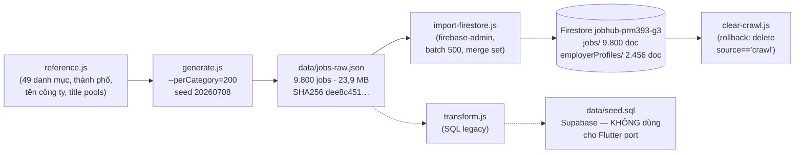
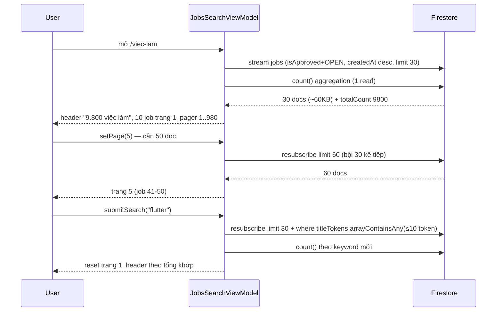

# Pipeline crawl → Firestore + lazy pagination

Tài liệu vận hành cho dataset synthetic TopCV (9.800 jobs) và cơ chế phân trang lười của màn
`/viec-lam`. Nguồn: `crawl-topcv/*.js`, `lib/features/jobs/data/jobs_repository.dart`,
`lib/features/jobs/viewmodels/jobs_search_viewmodel.dart`, `lib/shared/models/job_model.dart`,
`lib/shared/models/employer_profile_model.dart` (chỉ đọc — file này không sửa lib/).

## 1. Sơ đồ tổng quan

- `generate.js` sinh dữ liệu **deterministic** (mulberry32 seed `20260708`) nhưng ghi `crawled_at`
  = thời điểm chạy (`generate.js:257`) → SHA256 toàn file đổi mỗi lần chạy; nội dung trừ
  `crawled_at` là byte-identical (đối chứng trong `docs/10_CRAWL_DATASET.md` §5).
- Nhánh `transform.js → seed.sql` chỉ phục vụ bản web gốc (Supabase/Postgres). Flutter port
  đọc thẳng Firestore, bỏ qua nhánh này.

## 2. Hai collection đích

| Collection | Số doc | Schema (model Dart) | Ghi chú |
|---|---|---|---|
| `jobs` | 9.800 (`crawl-SYN-00001`…`crawl-SYN-09800`) | `lib/shared/models/job_model.dart` — `JobModel.fromJson/toJson` | `status='OPEN'`, `isApproved=true` → tính `isPublic`; `titleTokens` ≤60 token cho search |
| `employerProfiles` | 2.456 (`crawl-<slug-tên-công-ty>`) | `lib/shared/models/employer_profile_model.dart` — `EmployerProfile` | dedupe theo slug tên công ty (bỏ dấu, cắt 40 ký tự); `openPositions` đếm số job; `isVerified=true`, `source='crawl'` |

## 3. Bảng mapping trường raw → Firestore (import-firestore.js:80-144)

| Raw (`jobs-raw.json`) | Firestore `jobs` | Ví dụ / ghi chú |
|---|---|---|
| `source_job_id` | `jobId` (tiền tố `crawl-`) | `SYN-00001` → `crawl-SYN-00001` (làm doc id luôn) |
| `company_name` | `employerName` + doc `employerProfiles` | `"CÔNG TY TNHH …"` |
| `company_url` / `company_logo` | `employerWebsite` / `employerLogoUrl` | synthetic: `null` |
| `category_name` | `categoryName` | `"Nhân viên kinh doanh"` |
| `job_title` | `jobTitle` + `titleTokens` | token hoá mirror `JobModel.tokenize` (cap 60) |
| `job_detail.mo_ta_cong_viec` | `description.moTaCongViec` | mảng bullet |
| `job_detail.yeu_cau_ung_vien` | `description.yeuCauUngVien` | |
| `job_detail.quyen_loi` | `description.quyenLoi` | |
| `job_detail.thoi_gian_lam_viec` | `description.thoiGianLamViec` | `"Thứ 2 - Thứ 6 …"` |
| `job_detail.yeu_cau_kinh_nghiem` | `description.yeuCauKinhNghiem` | `"4 năm"` |
| `job_detail.yeu_cau_bang_cap` | `description.yeuCauBangCap` | thiếu → `"Không yêu cầu"` |
| `_salary_min` / `_salary_max` | `salaryMin` / `salaryMax` (VND) | thoả thuận → `null` |
| `_is_negotiable` | `isSalaryNegotiable` | 2.347 job (23,95%) |
| `_experience_enum` | `experienceLevel` | `INTERN…LEAD` (UPPER_SNAKE, khớp `enumToWire`) |
| `_work_mode` | `workMode` | `ONSITE/HYBRID/REMOTE` |
| `_job_type` | `jobType` | `FULL_TIME/PART_TIME/INTERNSHIP` |
| `location_text` | `city` + `employerCity` | giữ nguyên cả hậu tố `" & N nơi khác"` |
| `crawled_at` | `createdAt` (`Timestamp`) | thiếu → thời điểm chạy script |
| (tính từ createdAt) | `applicationDeadline` = createdAt + 60 ngày | |
| (hằng) | `status='OPEN'`, `isApproved=true`, `source='crawl'`, `positionsAvailable=1`, `requiredSkills=[]`, `country='Vietnam'`, `salaryPeriod='MONTH'` | |
| (hằng) | `updatedAt = FieldValue.serverTimestamp()` | |
| `salary_text`, `posted_text`, `category_slug`, `experience_tags` | — **không nhập** (chỉ để transform.js dùng) | |

employerProfiles: `uid` = `crawl-<slug>`, `companyName`, `city`, `industry` = `category_name`
của job đầu tiên, `openPositions` đếm dần, `source='crawl'`, `isVerified=true`.

## 4. Reproducible checklist

1. **Sinh lại dataset**: `cd crawl-topcv && node generate.js --perCategory=200` → 9.800 jobs,
   49 danh mục × 200, seed 20260708. ⚠️ Ghi đè `data/jobs-raw.json` (backup trước nếu cần so hash).
2. **Thống kê/đối chiếu**: `node stats.js` → `data/stats.json` (tổng quan, histogram, SHA256).
3. **Lấy SA key**: Firebase Console → Project Settings → Service accounts → *Generate new private
   key*. Đặt tại `crawl-topcv/` (gitignored) hoặc truyền positional arg.
4. **Dry run**: `node import-firestore.js --dry` — in 1 employer + 1 job mẫu + số lượng, không ghi.
5. **Import**: `node import-firestore.js <sa.json>` — batch 500 ops/lần commit, `set {merge:true}`
   (chạy lại không nhân đôi doc). Kết quả kỳ vọng: `Wrote 2456 employerProfiles + 9800 jobs`.
6. **Rollback**: `node clear-crawl.js --dry` (đếm) → `node clear-crawl.js` (xoá mọi doc
   `source=='crawl'` ở cả 2 collection).
7. **Verify**: Firebase Console → Firestore → tab Usage/Count hoặc query `jobs` với filter
   `source=='crawl'` → 9.800; `employerProfiles` → 2.456. Trong app: mở `/viec-lam`,
   header hiện "9.800 việc làm" (qua `countPublicJobs()`).

## 5. Troubleshooting

| Tình huống | Xử lý |
|---|---|
| **Rules deny khi dùng client SDK** | Admin SDK (SA key) **bypass rules hoàn toàn** — import không bị chặn. Nếu chuyển sang import bằng client SDK: jobs chỉ được `create` khi NTD sở hữu + phải DRAFT; dùng Admin SDK cho bulk. |
| **Batch > 500 ops** | Firestore giới hạn 500 thao tác/batch commit. Script đã cắt `slice(i, i+500)`; nếu thêm collection, giữ nguyên khúc cắt này. |
| **1 MiB document cap** | Mô tả job dài tối đa ~10 bullet (dataset này trung bình ~2,4 KB/doc — an toàn). Nếu import crawl thật từ TopCV: cắt `description` trước khi ghi; giám sát bằng `stats.js` (max bytes). |
| **Chi phí writes** | 9.800 + 2.456 = **12.256 writes ≈ $0,002** (ước tính $0,00018/1000 writes theo giá niêm yết; nằm sâu trong free tier hằng ngày). |
| **Import xong app vẫn thấy mock SYN-** | `mergeWithMocks` chỉ bỏ mock khi ≥50 job public — kiểm tra `isApproved=true` + `status='OPEN'` đã set chưa (import script luôn set). |
| **Hash khác nhau giữa 2 lần generate** | Bình thường — `crawled_at` là wall-clock (xem `docs/10_CRAWL_DATASET.md` §5). So hash sau khi bỏ trường này. |
| **Search không ra job mới** | `titleTokens` phải có mặt khi ghi (script đã tokenize mirror `JobModel.tokenize`); query `arrayContainsAny` giới hạn 10 token — keyword dài bị cắt (đã có contract test). |

## 6. Lazy pagination trên `/viec-lam` (Flutter)

### Luồng dữ liệu

### Chi tiết state (`JobsSearchState`)

- `loadedLimit` (mặc định `JobsRepository.defaultChunk = 30` = 3 trang × `pageSize 10`) — số doc
  stream đang yêu cầu.
- `totalCount` — kết quả `JobsRepository.countPublicJobs()` (aggregation `.count().get()`, ~1 read
  bất kể dataset); `null` cho tới khi trả về.
- `totalPages` = `(hasSearchContext || hasActiveFilters) ? ceil(filtered.length/10)`
  : `ceil((totalCount ?? filtered.length)/10)` → pager vẫn đọc "980" khi mới load 30 doc.
- `displayTotal` = filtered khi đang search/filter, ngược lại `totalCount ?? sourceJobs.length`
  → header "9.800 việc làm".
- `setPage(p)`: `needed = p*10`; nếu `needed > loadedLimit && loadedLimit < serverTotal` → bump
  `loadedLimit` lên bội 30 kế vượt `needed` (clamp ≤ `publicLimit 10000`), set `isLoadingMore`,
  resubscribe. Không bump khi chỉ đảo trang trong cửa sổ đã load.
- Đổi keyword (`submitSearch`): reset `loadedLimit=30`, `totalCount=null`, về trang 1, resubscribe
  + đếm lại (id guard `_countRequestId` bỏ response trễ).
- `mergeWithMocks(jobs)`: stream 30 doc thật ≥ ngưỡng 50 chỉ khi cộng dồn; khi chưa đủ
  (<50 public) vẫn trộn 12 mock SYN- cho demo.

### Vì sao

- Trước lazy pagination: `watchPublicJobs` limit 10.000 doc → payload ~20MB, first paint chậm,
  tốn reads. Sau: lần đầu **30 doc + 1 count** (~60KB), tổng số trang vẫn đúng nhờ count server-side.

### Hạn chế & hướng cải tiến

- **Nhảy sâu**: `setPage(500)` bump `loadedLimit` lên 5.010 ngay (~5s chờ + 5.010 doc reads).
  Cải tiến sau: cursor-based `startAfterDocument` (query từng trang thay vì mở rộng cửa sổ) —
  chưa làm.
- Filter client-side vẫn áp trên cửa sổ đã load: khi đang search, facet/label theo
  `filtered` trong 30-60 doc đã tải, không theo toàn bộ 9.800.
- Count aggregation cần index? — `.count()` dùng cùng index composite của query (đã có
  `isApproved+status+createdAt desc` trong `firestore.indexes.json`).
